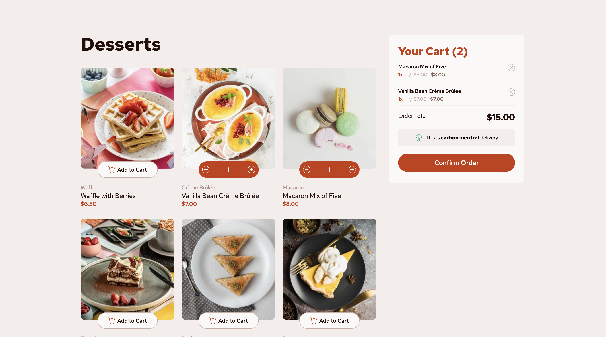

# Frontend Mentor - Product list with cart solution

This is a solution to the [Product list with cart challenge on Frontend Mentor](https://www.frontendmentor.io/challenges/product-list-with-cart-5MmqLVAp_d). Frontend Mentor challenges help you improve your coding skills by building realistic projects.

## Table of contents

- [Overview](#overview)
    - [The challenge](#the-challenge)
    - [Screenshot](#screenshot)
    - [Links](#links)
- [My process](#my-process)
    - [Built with](#built-with)
    - [What I learned](#what-i-learned)
    - [Continued development](#continued-development)
    - [Useful resources](#useful-resources)
- [Author](#author)
- [Acknowledgments](#acknowledgments)

**Note: Delete this note and update the table of contents based on what sections you keep.**

## Overview

### The challenge

Users should be able to:

- Add items to the cart and remove them
- Increase/decrease the number of items in the cart
- See an order confirmation modal when they click "Confirm Order"
- Reset their selections when they click "Start New Order"
- View the optimal layout for the interface depending on their device's screen size
- See hover and focus states for all interactive elements on the page

### Screenshot



### Links

- Solution URL: https://github.com/amjadsh97/product-list-with-cart
- Live Site URL: https://product-list-with-cart-livid.vercel.app/

## My process

### Built with

- Semantic HTML5 markup
- CSS custom properties
- Flexbox
- CSS Grid
- [React](https://reactjs.org/) - JS library


### What I learned

I learned how to handle product counts, unique product lists, and total price calculations in a shopping cart context using JavaScript. Here's a breakdown of what I implemented:
```js
  // Calculate the count of each product
const productCounts = selectedProducts.reduce((acc, product) => {
	acc[product.name] = (acc[product.name] || 0) + 1;
	return acc;
}, {} as Record<string, number>);

// Create a list of unique products with their counts
const uniqueProducts = selectedProducts.reduce((acc: Product[], product) => {
	if (!acc.find(p => p.name === product.name)) {
		acc.push(product);
	}
	return acc;
}, []);

// Calculate total price
const totalPrice = selectedProducts.reduce((acc, product) => acc + product.price, 0);

```
### Continued development
I plan to create a new full-stack application for product management in the future, expanding on these concepts to build a more robust and comprehensive solution.
### Useful resources

- [React Docs](https://react.dev/) - This helped me for building react components. I really liked using this docs.


## Author

- Website - [Amjad Shadid](https://amjadshadid.com)
- Frontend Mentor - [@amjadsh97](https://www.frontendmentor.io/profile/amjadsh97)
- Twitter - [@Amjadshadid](https://twitter.com/Amjadshadid)
- Linkedin - [@Amjad Shadid](https://www.linkedin.com/in/amjad-shadid-134355134/)